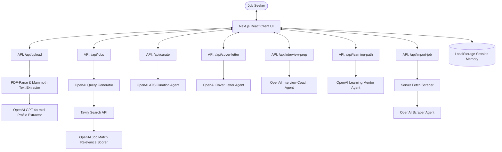
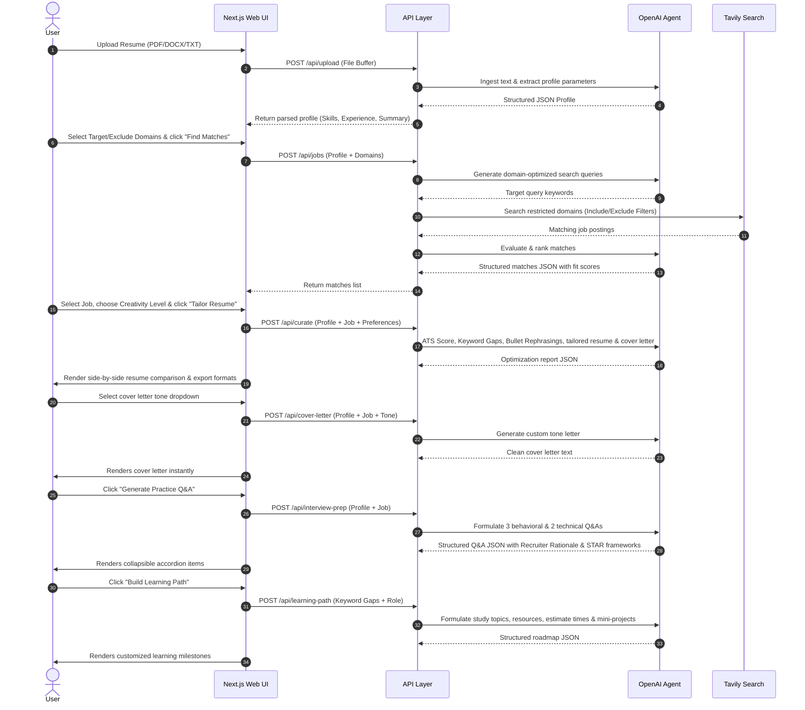

# ElevateCV - Agentic Resume Curator & Job Matcher

ElevateCV is a full-stack Next.js (TypeScript) application designed to help active job seekers parse their resumes, search for matching job postings agentically using Tavily, analyze keyword gaps, customize bullet points, and draft tailored cover letters.

---

## 🛠️ Technology Stack

| Application Layer | Technologies & Libraries | Role in Application |
| :--- | :--- | :--- |
| **Frontend UI** | Next.js 16 (App Router), React 19, TypeScript | Implements responsive upload drop-zones, live ATS circular meters, historical session logs, and interactive tabs. |
| **Styling** | Vanilla CSS | Custom animations, fonts, and dark glassmorphic design systems. |
| **Ingestion Engine** | `pdf-parse`, `mammoth` | Text extraction from PDF, DOCX, and TXT files. |
| **AI Optimizer** | OpenAI SDK (`gpt-4o-mini`) | Generates profile extractions, search terms, bullet point alignments, tone changes, STAR interview Q&As, and roadmaps. |
| **Reranking Layer** | Cohere Rerank API (`rerank-v3.5`) | Performs high-accuracy contextual re-ranking of retrieved resume chunks against job requirements in the advanced retrieval benchmark. |
| **Agentic Search** | Tavily Search API | Restricts or block portals from search matches utilizing inclusion and exclusion list arguments. |
| **Telemetry & Log** | LangSmith SDK wrapper (`wrapOpenAI`) | Telemetry logging of LLM operations under the `elevateCV` workspace. |
| **Testing & Execution** | Node.js native `node:assert`, `tsx` execute runner | Test suite assertions validating parsing, cleaning, and cosine math functions. |

---

## 📂 Project Layout

Below is the directory map illustrating how files are structured:

```
├── deliverables.md                    # Challenge answers report
├── README.md                          # Main documentation & architecture guides
├── package.json                       # Scripts (dev, build, test) and package dependencies
├── tsconfig.json                      # TypeScript configuration
├── next.config.js                     # Next.js bundler settings
├── .env                               # Local credentials configuration (keys, tracing options)
├── .env.example                       # Shared credentials template
├── diagrams/                          # Raw Mermaid specification diagrams
│   ├── architecture.mmd               # System Architecture flowchart specs
│   └── agent_flow.mmd                 # Ingestion & optimization sequence specs
├── scripts/                           # Dev and evaluation scripting utilities
│   └── run_evals.ts                   # Cosine similarity vs. Cohere Reranking harness
├── tests/                             # Unit tests & evaluations
│   ├── unit_tests.ts                  # Assertions checking parsing and math math
│   └── evals_output.md                # Comparative MAE score reports
├── src/
│   ├── app/                           # Next.js Pages and routes
│   │   ├── page.tsx                   # Main React entrypoint & responsive dashboard UI
│   │   ├── globals.css                # Global glassmorphic styling theme
│   │   └── api/                       # Backend endpoints
│   │       ├── upload/                # Extracts structured profiles from files
│   │       ├── jobs/                  # Generates search terms, queries Tavily, and filters matches
│   │       ├── curate/                # ATS matching, rephrasing generator, tailored CV/Cover letter
│   │       ├── cover-letter/          # Dynamic on-demand cover letter tone regenerations
│   │       ├── interview-prep/        # Recruiter AI technical/behavioral practice questions
│   │       ├── learning-path/         # Bridging timelines & portfolio projects for gaps
│   │       ├── import-job/            # Fetches URL and extracts postings using OpenAI
│   │       └── evaluate/              # Renders metrics for display
│   └── utils/                         # Global helper methods
│       ├── openai.ts                  # OpenAI wrapped SDK client
│       └── parser.ts                  # PDF/DOCX buffer extractor (with PDF worker absolute paths)
```

---

## 🏗️ System Architecture

*   Raw specification file: [diagrams/architecture.mmd](diagrams/architecture.mmd)

The following diagram illustrates the relationship between the Next.js frontend, backend API routes, the parsing engine, Tavily Search API, and OpenAI's GPT-4o-mini LLM:



---

## 🚢 Agentic Curation Flow

*   Raw specification file: [diagrams/agent_flow.mmd](diagrams/agent_flow.mmd)

The sequential flow below shows how user actions trigger agent behaviors from ingestion to matching and optimization:



---

## 🌟 Key Features

| Feature | Capability | Interface Location |
| :--- | :--- | :--- |
| **Multi-Format Ingestion** | Support for parsing text from binary PDF, Word DOCX, and plain TXT files. | Applicant Tab / Drop Zone |
| **Agentic Matching** | Tavily-restricted query crawler generating relevant openings scored and sorted by AI. | Job Matcher Tab |
| **Manual & URL Import** | Scrapes external job pages using LLM text extraction to auto-populate descriptions. | Custom Job Panel |
| **Real-Time ATS Tracker** | Progress bar indicating keyword alignment percentage, automatically checking off integrated skills in green. | Real-Time Tracker Panel |
| **Interactive A4 Editor** | White paper sheet canvas rendering real-time edits from a side-by-side markdown text-editor. | Tailored Resume Section |
| **Interactive Bullets** | Checkbox selectors to individually accept or reject rephrased experience statements, replacing text inline. | Experience Optimization |
| **Tone Adjuster** | Selector to instantly regenerate cover letters in different styles (Friendly, Direct, Bold). | Cover Letter Area |
| **Outreach Generator** | API route drafting customized LinkedIn messages (under 300 char) or cold emails to recruiters. | Recruiter Outreach Block |
| **AI Interview Coach** | Generates Recruiter Q&As with situational rationale and custom STAR responses. | AI Interview Trainer |
| **Custom Learning Roadmap** | Actionable timeline indicating resources and project ideas to bridge keyword gaps. | Milestone Roadmap |
| **Multi-Format Export** | Direct downloads for Resumes & Cover Letters as TXT, Word DOC, or styled PDF layouts. | Actions Footers |
| **Session History** | Auto-saves applicant profiles and tailored resume edits locally for instant retrieval. | Local History Logs |
| **LangSmith Telemetry** | Captures prompts and telemetry under the `elevateCV` project. | LangSmith Workspace |

---

## 🚀 Setup & Installation

### Prerequisites
*   Node.js (v18+)
*   An OpenAI API key and a Tavily API key.

### Configuration
1.  Clone the repository and navigate to the project folder.
2.  Create a `.env` file in the root directory:
    ```env
    OPENAI_API_KEY="your_openai_api_key_here"
    TAVILY_API_KEY="your_tavily_api_key_here"
    COHERE_API_KEY="your_cohere_api_key_here"

    # LangSmith Tracing (Optional)
    LANGSMITH_TRACING=true
    LANGSMITH_API_KEY="your_langsmith_api_key_here"
    LANGSMITH_PROJECT="elevateCV"
    ```

### Install Dependencies
```bash
npm install
```

### Start Development Server
```bash
npm run dev
```
Open [http://localhost:3000](http://localhost:3000) to view the application in the browser.

### ☁️ Deploying to Vercel

As a Next.js application, ElevateCV is fully compatible with [Vercel](https://vercel.com) for production hosting.

#### Option 1: Deploying via Vercel Git Integration (Recommended)
1. Push your codebase to a Git repository (GitHub, GitLab, or Bitbucket).
2. Sign in to the [Vercel Dashboard](https://vercel.com).
3. Click **Add New** -> **Project** and import your Git repository.
4. Under the **Environment Variables** section, copy the environment variables from your local [.env](.env) or [.env.example](.env.example):
   - `OPENAI_API_KEY`: Your OpenAI API Key.
   - `TAVILY_API_KEY`: Your Tavily Search API Key.
   - *(Optional)* `LANGSMITH_TRACING`, `LANGSMITH_API_KEY`, and `LANGSMITH_PROJECT` if telemetry is active.
5. Click **Deploy**. Vercel will automatically build the Next.js production build and publish your site.

#### Option 2: Deploying via Vercel CLI
1. Install the Vercel CLI globally:
   ```bash
   npm install -g vercel
   ```
2. Authenticate the CLI with your Vercel account:
   ```bash
   vercel login
   ```
3. Initialize the deployment from the repository root:
   ```bash
   vercel
   ```
4. Configure the environment variables on Vercel:
   ```bash
   vercel env add OPENAI_API_KEY your_openai_api_key_here
   vercel env add TAVILY_API_KEY your_tavily_api_key_here
   ```
5. Deploy to production:
   ```bash
   vercel --prod
   ```

---

## 🧪 Testing and Evaluations

### Run Unit Tests
We use Node's native assertion suite to test parsing, domain logic, and similarity functions:
```bash
npm test
```

### Run Evaluation Harness
Run the offline evaluation benchmark comparing Baseline (Full embedding cosine) vs. Advanced (Chunk RAG + Cohere Reranking) over 25 test combinations:
```bash
npx tsx scripts/run_evals.ts
```
Results will print a performance breakdown table and save it to `tests/evals_output.md`.
