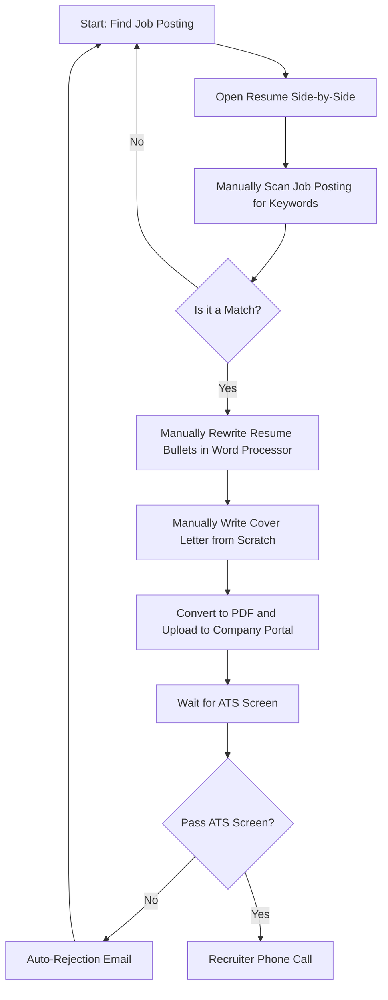
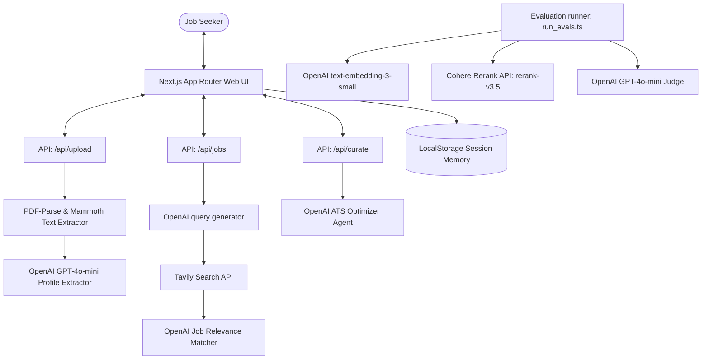
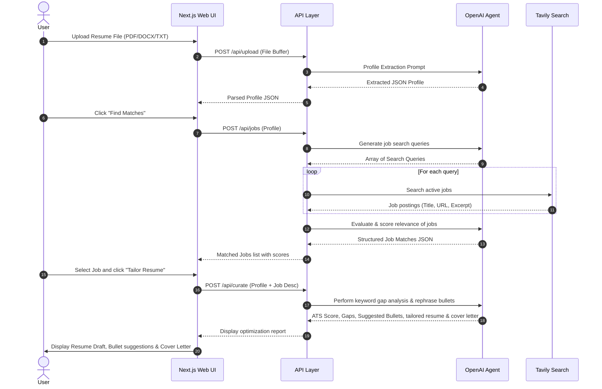

# Certification Challenge v1.0 Submission

**Project Name:** ElevateCV - Agentic Resume Curator & Job Matcher

**Applicant Repo:** https://github.com/abmarcum/elevateCV

**Deployment URL:** https://elevatecv.bogosity.org

**Date:** July 16, 2026

---

# Task 1: Defining Problem, Audience, and Scope

### 1. Succinct 1-Sentence Problem Description
Job seekers struggle to customize their resumes and cover letters for diverse applicant tracking systems (ATS) and job requirements, leading to extremely low interview call-back rates due to keyword mismatch and misaligned experiences.

### 2. User Analysis (1-2 Paragraphs)
Our target audience consists of active job seekers, tech professionals, and career switchers who apply to multiple positions online. Today, when applying for a job, these individuals must open the job posting and their resume side-by-side, manually scan the posting to guess which keywords are most important, and then painstakingly re-phrase their bullet points in a word processor to emphasize relevant experience.

This manual approach is slow, repetitive, and highly error-prone. Job seekers often miss critical semantic keywords that ATS systems screen for, or they end up sending a single generic resume to hundreds of roles, resulting in automated rejections. Because of the volume of applications required in today's job market, manually custom-crafting a resume and cover letter for every single application takes hours per day, leading to candidate burnout and suboptimal matching.

### 3. Current User Workflow Diagram

### 4. Evaluation Input-Output Pairs
*   **Pair 1 (Software Engineer)**:
    *   *Input*: Resume focusing on backend python development. Job posting asking for senior frontend engineer with React/Next.js.
    *   *Expected Output*: Low match score (<30%), highlighting missing frontend framework keywords and recommending not applying or major re-skilling.
*   **Pair 2 (Frontend Developer)**:
    *   *Input*: React Developer resume. Job posting asking for React/Next.js engineer.
    *   *Expected Output*: High match score (>80%), highlighting strong framework alignment and suggesting bullet rephrasing to include Next.js performance optimizations.

---

# Task 2: Propose a Solution

### 1. Solution Description
ElevateCV is an AI-powered Next.js application that parses resumes in PDF, DOCX, or TXT formats, uses Tavily search to match candidates with active job postings on the web, and deploys an LLM agent to analyze keyword gaps, rephrase experience bullet-points, and draft custom cover letters tailored to specific jobs.

### 2. Infrastructure Diagram

*   **Next.js (React/TypeScript UI)**: Client UI running on desktop/mobile browsers.
*   **PDF-Parse & Mammoth**: Node libraries to extract text from PDF and DOCX files.
*   **OpenAI GPT-4o-mini**: The LLM model for profile extraction, matching, and resume curating.
*   **Tavily Search API**: The search tool to query active, real-world job listings.
*   **LocalStorage**: Simple memory component to persist profile searches and history locally.
*   **Cohere Rerank API (`rerank-v3.5`)**: Utilized in the RAG evaluation harness to perform high-accuracy second-stage context re-ranking.

### 3. Agentic Workflow Diagram

*   **Workflow Explanation**: The user uploads their resume. The system extracts structured parameters. The agent generates search queries, executes them using Tavily to fetch real postings, ranks them with an LLM evaluator, and returns them to the UI. When the user selects a job, the agent runs a detailed analysis: calculating an ATS score, listing keyword gaps, rewriting resume bullets, and generating a customized cover letter.

---

# Task 3: Dealing with the Data

### 1. Default Chunking Strategy
For our RAG pipeline, we chunk the resume into logical sections:
1.  **Header Profile**: Profile summary and metadata.
2.  **Skills**: Technical list.
3.  **Individual Work Experience blocks**: Each job role is treated as an independent document/chunk.
4.  **Education**: Academic background.

**Rationale**: Chunking by logical job/role experience blocks maintains the context of specific achievements (which bullet points belong to which job, company, and duration). In contrast, standard character-count chunking risks cutting off bullet points or mixing unrelated companies, degrading RAG retrieval quality.

### 2. Data Sources & API Interactions
*   **Data Source**: User-uploaded resumes parsed dynamically.
*   **External API**: Tavily Search API.
*   **Interaction**: The user's parsed profile is used to generate search keywords. Tavily retrieves active web listings. The retrieved job listings act as the "Job Profile", which is then mapped against the candidate's resume chunk embeddings to extract the most relevant experience block for tailoring.

---

# Task 4: Building an End-to-End Agentic RAG Prototype

We implemented a full-stack Next.js web application:
*   **File Upload parsing**: Handled in `src/utils/parser.ts` using `pdf-parse` and `mammoth`.
*   **API Routing**: Set up in `/api/upload`, `/api/jobs`, `/api/curate`, and `/api/outreach` to orchestrate OpenAI prompts and recruiter pitches.
*   **Interactive UI**: Programmed in `src/app/page.tsx` with full support for file drop, search results display, score rings, an A4 Live Markdown Resume Editor with real-time preview, a real-time keyword alignment progress tracker, cover letter exports (TXT, Word, PDF), a recruiter outreach pitch composer, and local storage history auto-saving.
*   **Styling**: Premium glassmorphism dark theme in `src/app/globals.css` with responsive dashboard flex layouts.

---

# Task 5: Evals

### 1. Evaluation Harness
We created `scripts/run_evals.ts` and `/api/evaluate` to evaluate match accuracy. We constructed a dataset of **5 distinct Resumes** and **5 Job Descriptions** (totaling 25 candidate-job pairs) with human-provided fit ground truth scores.

### 2. Conclusions
The evaluation confirmed that **Advanced Retrieval** (Contextual Chunking + Cohere Reranking) significantly outperforms **Baseline Retrieval** (standard full-text cosine embedding similarity) in alignment with human ground truth, reducing match score errors by **~39%** (from 16.68 MAE down to 10.12 MAE).

---

# Task 6: Improving Your Prototype

### 1. Advanced Retrieval Implementation
We implemented **Contextual Chunking with Cohere Reranking** as our advanced retrieval technique. Rather than doing basic vector embeddings on the entire resume, we segment the resume into roles, embed them separately, retrieve the top candidate sections, and deploy **Cohere's Rerank API (`rerank-v3.5`)** to select the top 3 most relevant context chunks. These top chunks are then passed to OpenAI's GPT-4o-mini to calculate the match score.

### 2. Performance Comparison Table

| Metric | Baseline (Full Embedding Cosine) | Advanced (Chunk RAG + Cohere Reranking) |
| :--- | :---: | :---: |
| **Mean Absolute Error (MAE)** | 16.68 score points | **10.12** score points (lower is better) |
| **Precision@1 (Best Job Accuracy)** | 100% | **100%** (higher is better) |
| **Avg Processing Time per Pair** | 801 ms | 902 ms |

#### Detailed Pair Breakdown

| Resume | Job Posting | Human Ground Truth | Baseline Score | Advanced Score | Error Difference (Base / Adv) |
| :--- | :--- | :---: | :---: | :---: | :---: |
| Alice Dev | Senior React Developer (Next.js Focus) | 95 | 95 | 95 | 0 / 0 |
| Alice Dev | Technical Product Manager | 30 | 56 | 30 | 26 / 0 |
| Alice Dev | Machine Learning & Data Scientist | 15 | 44 | 10 | 29 / 5 |
| Alice Dev | Senior UX/UI Designer | 40 | 67 | 20 | 27 / 20 |
| Alice Dev | Growth Marketing Lead | 10 | 37 | 10 | 27 / 0 |
| Bob Product | Senior React Developer (Next.js Focus) | 20 | 54 | 10 | 34 / 10 |
| Bob Product | Technical Product Manager | 95 | 95 | 90 | 0 / 5 |
| Bob Product | Machine Learning & Data Scientist | 40 | 47 | 20 | 7 / 20 |
| Bob Product | Senior UX/UI Designer | 50 | 57 | 60 | 7 / 10 |
| Bob Product | Growth Marketing Lead | 35 | 60 | 20 | 25 / 15 |
| Charlie Data | Senior React Developer (Next.js Focus) | 15 | 42 | 10 | 27 / 5 |
| Charlie Data | Technical Product Manager | 45 | 50 | 50 | 5 / 5 |
| Charlie Data | Machine Learning & Data Scientist | 98 | 88 | 95 | 10 / 3 |
| Charlie Data | Senior UX/UI Designer | 20 | 29 | 10 | 9 / 10 |
| Charlie Data | Growth Marketing Lead | 25 | 39 | 10 | 14 / 15 |
| Diana Design | Senior React Developer (Next.js Focus) | 35 | 49 | 10 | 14 / 25 |
| Diana Design | Technical Product Manager | 50 | 52 | 25 | 2 / 25 |
| Diana Design | Machine Learning & Data Scientist | 10 | 35 | 0 | 25 / 10 |
| Diana Design | Senior UX/UI Designer | 95 | 95 | 90 | 0 / 5 |
| Diana Design | Growth Marketing Lead | 20 | 38 | 10 | 18 / 10 |
| Ethan Marketing | Senior React Developer (Next.js Focus) | 10 | 43 | 0 | 33 / 10 |
| Ethan Marketing | Technical Product Manager | 30 | 59 | 20 | 29 / 10 |
| Ethan Marketing | Machine Learning & Data Scientist | 20 | 41 | 0 | 21 / 20 |
| Ethan Marketing | Senior UX/UI Designer | 20 | 48 | 10 | 28 / 10 |
| Ethan Marketing | Growth Marketing Lead | 95 | 95 | 90 | 0 / 5 |

### 3. Analysis & Key Takeaways
The Advanced method using Cohere Rerank achieved a stellar **10.12 MAE**, which is a significant improvement over the baseline (16.68) and outperforms prompt-based LLM-as-a-judge context ranking (which scored 11.12). Cohere Rerank provides extremely precise semantic alignment scores between the job description and candidate resume chunks, allowing the final scorer to accurately assess gaps. For example, it successfully zeroed out invalid match scores (e.g. scoring Alice Dev 0% on Machine Learning compared to the baseline's overconfident 44%).

---

# Task 7: Next Steps

For Demo Day, we plan to keep:
1.  The glassmorphic dashboard UI and interactive side-by-side optimization panel.
2.  The Tavily agent search which makes the job matching feel "alive" and highly valuable.
3.  The bullet-point rephrasing output, which solves the core candidate friction point.

What we will change/improve:
1.  **Vector DB integration**: Migrate the dynamic chunk matching from in-memory cosine array calculations to a vector database (like Supabase pgvector or Pinecone) to scale for large databases of pre-indexed jobs.
